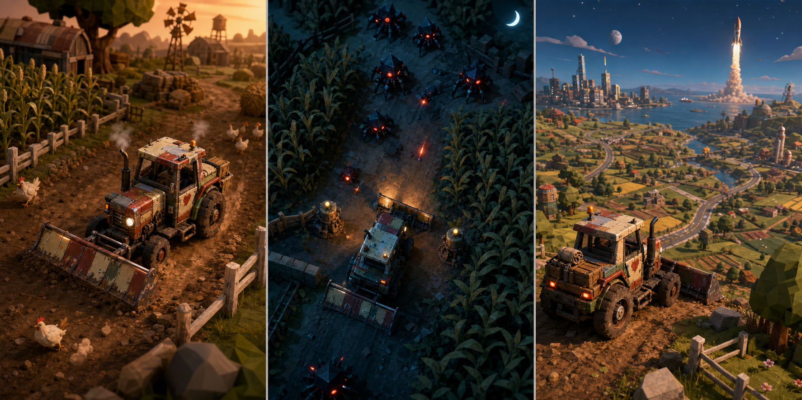

# Design Direction

Status: **exploratory; not an accepted final art direction**

The triptych is a generated concept probe, not production art. It successfully keeps a repaired fictional tractor and wide plow legible across warm farm, tactical night, and larger-world promise. It also exposes questions: the night enemies currently read as generic spider drones, the future vista is more conventional than the farm, and the tractor’s exact condition/module continuity needs a stricter model sheet. See the [asset provenance record](docs/research/ASSET_PROVENANCE_REGISTER.md).

## Direct preference signal — 2026-07-25

The project owner explicitly likes the triptych’s vehicle design and scene viewpoint and wants this direction explored further. That strengthens—not finalizes—the Patchwork Atlas lead.

The favored qualities are now more precisely defined:

- a persistent repaired machine large enough in frame to feel like a character;
- richer material and repair detail on the vehicle than on the simplified diorama world;
- close three-quarter chase/near-isometric play for personality;
- higher tactical framing when spatial information becomes more important;
- warm workday versus cool dangerous-night state contrast;
- immediate verb, local opportunity, and distant world promise in the same view;
- functional attachments that change silhouette and capability.

Three project-local boards now explore a canonical tractor character, six gameplay camera roles, and a fair Patchwork Atlas/Signal Noir/Salvage Opera comparison. See [Visual Direction Preference and Variants](docs/exploration/VISUAL_DIRECTION_PREFERENCE_AND_VARIANTS_2026-07-25.md).

Current interpretation:

- Patchwork Atlas is the baseline language.
- Signal Noir is a danger/information-state transformation.
- Salvage Opera is a rare region/event crescendo.

Concept-art depth-of-field, darkness, and spectacle are not runtime targets until active-play readability and performance are measured.

## Experience promise

Vehicles are characters. The player should be able to recognize a machine by silhouette, movement, sound, wear, attached tools, and the stories visible on its body—not only by a nameplate or rarity color.

The interface should feel like a field kit attached to a changing machine, not a generic dashboard placed over every genre.

## Proposed visual grammar: Patchwork Atlas

The leading exploration direction combines:

- tactile, hand-built diorama environments;
- bold, readable vehicle silhouettes;
- visible repair seams, swapped modules, stickers, mud, scorch, crop dust, and cosmic residue;
- restrained color by biome, with high-contrast interaction cues;
- dramatic changes in light and atmosphere to signal a mechanical shift;
- ordinary objects becoming monumental when scale changes;
- grounded material response rather than universal neon glow.

This can make a tractor, toy car, bicycle, and rocket belong to one world without making them visually identical. “Patchwork” supplies continuity; each region supplies its own rules and palette.

## Two counter-directions to prototype

### Signal Noir

Hard silhouettes, pools of light, long shadows, sparse color, and radio-like UI. Strong for night defense, stealth, and top-down gunplay. Risk: it may suppress the warmth, collecting pleasure, and visual variety needed for farming and toy-scale play.

### Salvage Opera

Large skies, expressive machinery, colorful exhaust, impossible grafted modules, and theatrical vistas. Strong for aspiration and sharing. Risk: effects and scale can obscure interaction readability and overwhelm low-power devices.

Neither direction should be merged into Patchwork Atlas by default. A screenshot comparison should test which one best communicates the core loop.

## Vehicle character rules

- Silhouette communicates locomotion class before surface detail.
- Every attachment changes both appearance and at least one usable capability.
- Damage and repair tell a story; they are not random grunge.
- Rarity is expressed through unusual function and history, not just chroma.
- Real-world-inspired vehicles must avoid unlicensed brands, protected liveries, and deceptive replicas.
- A hybrid must show a legible parentage: what was grafted, why, and what tradeoff it caused.

### Restoration arc

The first tractor should begin dilapidated/basic and grow toward the robust preferred concept without being replaced by a different tractor.

Visual continuity must preserve recognizable bones: cab/roof silhouette, round-light face, wheel stance, beacon or mounting history, signature patch, chassis proportions, and meaningful scars.

Treat four changes differently:

- core restoration makes a broken system dependable;
- chassis tuning changes feel and tradeoffs;
- physical modules change available verbs and silhouette;
- deployed states change how an already installed module behaves.

Robust means capable and structurally convincing, not clean, over-armored, or covered with every unlocked attachment. See [Tractor Restoration and Modular Growth](docs/exploration/TRACTOR_RESTORATION_AND_MODULAR_GROWTH_2026-07-25.md).

## World rules

- A location should support at least two states or uses: day/night, calm/crisis, small/giant, ground/air, owned/contested, seasonal/corrupted.
- Procedural variation operates inside authored composition rules and validated traversal.
- Landmarks, routes, and affordances remain readable at gameplay speed.
- The same place visibly remembers player actions.
- Genre changes use diegetic transitions—entering a shadow zone, launching from a silo, shrinking through a workshop portal—not a contextless menu.

## UI rules

- Primary play uses low-chrome HUD layers; collection and workshop screens can be richer.
- Core status is visually attached to the vehicle where possible: lights, smoke, cargo, tool posture, audio, and decals.
- DOM-based HUD is preferred for accessibility and responsive layout unless measurement proves a canvas-only element necessary.
- Keyboard, gamepad, pointer, and touch share named actions.
- Interaction prompts explain the verb and consequence, not only the button.
- Use icon + text + state; never rely on color alone.
- Respect reduced motion, volume categories, scalable text, remapping, hold/toggle alternatives, subtitles, and high-contrast modes.

## Camera grammar

- Chase/near-isometric for traversal and vehicle personality.
- Top-down for dense tactical readability.
- Side or fixed framing only for authored set pieces.
- Transitions must preserve orientation and telegraph control changes.
- Camera collision, occlusion, motion comfort, and target reacquisition are first-class gameplay systems.

## Audio grammar

- Each vehicle has a layered mechanical voice: idle, load, traction, damage, tool, boost, and environment response.
- Music follows world state and player pressure rather than running as a constant wallpaper.
- Important threats and interaction states require non-audio equivalents.
- Generated audio, if explored, remains a proposal until rights, provenance, editing, loudness, looping, and in-game fit are reviewed.

## Browser visual budgets to measure

No numbers are accepted yet. The engine probes must establish separate desktop and mobile targets for:

- initial compressed download;
- time to first controllable frame;
- active object and physics-body counts;
- draw calls, triangles, texture memory, particles, lights, and shadow casters;
- CPU/GPU frame time;
- resolution scaling and fallback behavior.

## Anti-slop checks

- No generic purple-gradient landing-page visual language.
- No card grid pretending to be a game interface.
- No effects added solely to make a screenshot look “premium.”
- No tiny unreadable text or controls.
- No identical vehicle feel hidden beneath different meshes.
- No procedural expanse without authored reasons to move through it.

## Kenney source-library policy

The locally owned Kenney All-in-1 3.4.0 library is a strong prototype substrate, not an automatic final style. Its Car, Nature, Toy Car, and Space previews show a compatible low-poly readability language, and selected assets can make engine and mechanic comparisons materially fairer.

Rules:

- use exact source binaries for cross-engine fixtures;
- import only named assets needed by a current experiment;
- keep the paid bundle outside the project and never redistribute it directly;
- preserve per-pack CC0 evidence and source/derived hashes;
- keep semantic game identity separate from filenames and scene nodes;
- add authored wear, repair history, functional attachments, biome palettes, lighting, effects, and audio before claiming Patchwork Atlas fidelity;
- reject a raw multi-pack collage if players recognize the asset library before they recognize their machine and world.

See the [Kenney asset library audit](docs/research/KENNEY_ASSET_LIBRARY_AUDIT_2026-07-25.md).

## Anything else?

The design test is not “does this look like a polished game?” It is “can a player infer what this machine can do, what has happened to it, and what possibility is calling from the world?”
