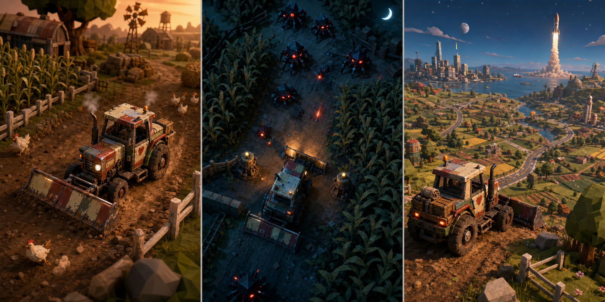
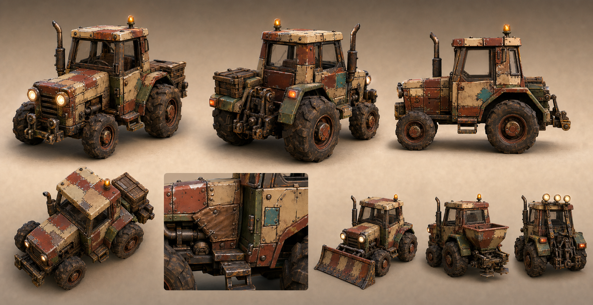
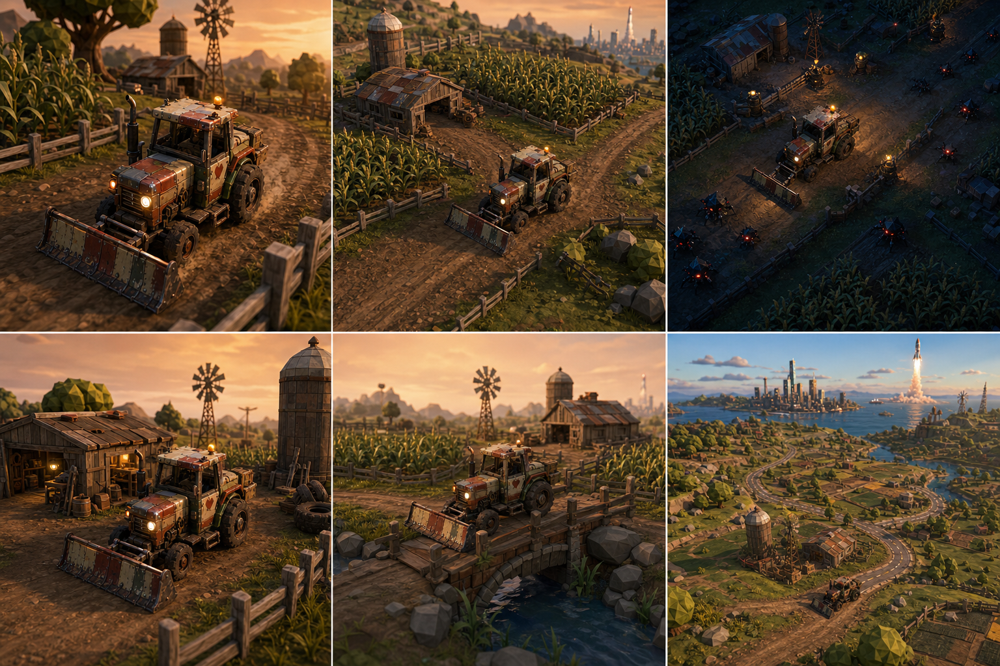
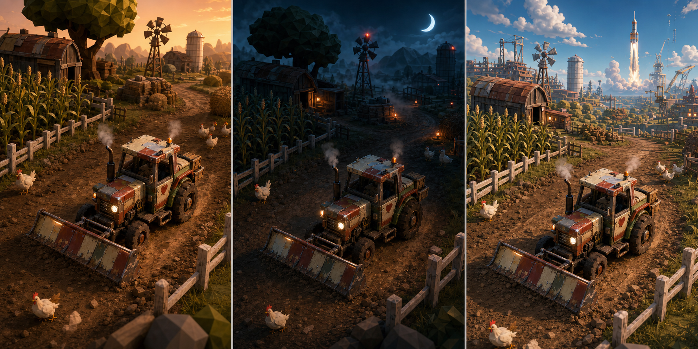

# Visual Direction Preference and Variants

- Status: **preferred visual signals recorded; final art direction and runtime camera remain Proposed**
- Date: 2026-07-25
- Preference source: direct project-owner feedback on the preserved triptych
- Purpose: translate “I like this design and view” into testable character, camera, world, material, and lighting rules

## Preserved preference reference



Project owner preference:

> “I like the design and view of the character/scene and would like this kind or explore more.”

The preference is treated as a strong direction signal, not final production approval. The useful qualities must survive real gameplay, browser performance, input, accessibility, asset production, and player observation.

## What the preference is actually pointing toward

### Vehicle as a character

- The tractor fills enough of the frame to be read as the protagonist, not a cursor.
- The cab, two round work lights, exhaust, beacon, tire proportions, and broad front tool create a face and stance without anthropomorphic eyes.
- Repair patches and mismatched panels imply history.
- Wear is localized and causal rather than a uniform dirt overlay.
- Attachments alter silhouette and implied verbs.
- The machine feels practical, loved, and capable rather than pristine, military, or disposable.

### Selective-detail visual system

The reference is not uniformly low-poly. It uses:

- richer vehicle geometry, surface wear, bolts, seams, glass, rubber, and functional joints;
- simpler, chunkier foliage, rocks, buildings, roads, and distant world geometry;
- a strong detail gradient from hero vehicle to nearby affordances to distant promise;
- restrained palettes with small emissive accents;
- tactile diorama composition and readable environmental modules.

This is more specific than “stylized 3D” and should become a production rule: spend detail where identity and interaction live.

### Gameplay view

- A close three-quarter chase/near-isometric view is the strongest default for vehicle personality.
- A medium near-isometric view exposes routes, plots, and nearby opportunities while keeping the tractor emotionally present.
- A higher tactical view supports night defense when threats and spatial planning become more important.
- Wide overlooks sell connected-world ambition, but should be short reveal moments rather than sustained control views where the vehicle becomes tiny.
- Camera transitions should preserve heading, landmark position, and immediate affordances.

### World composition

Every strong frame has three scales:

1. **Immediate verb:** tractor, plow, dirt lane, fence gap, crop row, threat, or workshop.
2. **Local possibility:** barn, silo, wind pump, branching road, bridge, field, or defensive structure.
3. **Distant promise:** city, launch site, mountain, unusual light, or another region.

The player should be able to see something worth doing now and something worth becoming later.

### Light and state

- Day: warm amber light, ochre soil, sage/corn greens, readable cream and rust-red vehicle panels.
- Night: deep navy environment, localized amber work lights, sparse red danger cues, and moonlit route silhouettes.
- Expansion/event: clear blue-gold sky, large landmarks, mechanical spectacle, and restrained effects.

The night is a mechanical state change, not a blue color grade. Lights reveal, repel, guide, or power something.

## Generated exploration boards

The image-generation skill was used in built-in reference-guided generation mode. The preserved preference image was a style, material, mood, and camera-readability reference—not an edit target.

### 1. Persistent tractor character sheet



What works:

- stable cream/rust-red/green identity across major views;
- excellent tire ratio and workhorse stance;
- expressive round lights without turning the vehicle into a face;
- visible repair grammar and a memorable turquoise patch;
- functional front/rear hardpoints;
- plow, hopper/spreader, and light-rig directions remain recognizable.

What needs tightening:

- produce true orthographic front/side/rear turnarounds before modeling;
- define an exact canonical patch map so damage history does not drift between images;
- separate installed tool, carried cargo, and permanent chassis detail;
- verify module pivots and collision envelopes in a real 3D source;
- reduce decorative fasteners where they do not communicate construction or repair.

### 2. Gameplay camera board



What works:

- close chase and medium near-isometric views preserve the tractor as protagonist;
- the tactical view clearly changes the information priority;
- workshop framing creates intimacy without requiring an on-foot avatar;
- the bridge view suggests authored set pieces using the same controls;
- the wide view connects farm, roads, city, and launch aspiration.

What needs tightening:

- real gameplay needs less shallow depth-of-field than these concept renders;
- the wide vista makes the tractor too small for sustained control;
- the tactical threat silhouettes remain too close to generic spider drones;
- occlusion, camera collision, aim/steering direction, and target reacquisition need runtime tests;
- mobile framing and safe HUD regions remain unproven.

### 3. Fair art-direction comparison



Interpretation:

- **Patchwork Atlas** is the strongest baseline: warmth, readable materials, repair culture, and invitation.
- **Signal Noir** works as a night biome/state layer: pools of work light and tactical shadow. It is too dark if used without exposure and accessibility controls.
- **Salvage Opera** works as a rare reveal, world event, launch region, or late-game escalation. Used everywhere, its industrial skyline and spectacle would compete with local verbs.

These are not three incompatible games. They can form a hierarchy:

```text
Patchwork Atlas = persistent base language
Signal Noir = danger/information-state transformation
Salvage Opera = aspiration/event/region-scale crescendo
```

The hierarchy prevents averaging all three into a visually noisy compromise.

## Proposed visual contract

### Stable tractor identity

Until a model sheet supersedes it, preserve:

- faded cream roof and upper panels;
- rust-red hood and major repaired plates;
- muted field-green fenders/lower panels;
- one small turquoise repair patch;
- two round forward work lights;
- one amber roof beacon;
- black vertical exhaust;
- large rear / smaller front tire ratio;
- visible front and rear modular mounts;
- broad plow as the first signature tool.

An installed module may change silhouette. It must not randomly change the chassis, cabin, repair history, colors, or wheel proportions.

### Camera hypotheses to test

| State              | Proposed view                            | Information priority                            | Failure signal                                                         |
| ------------------ | ---------------------------------------- | ----------------------------------------------- | ---------------------------------------------------------------------- |
| Traversal          | close three-quarter chase/near-isometric | machine feel, route, next affordance            | tractor blocks route or camera motion causes discomfort                |
| Farming/work       | medium near-isometric                    | rows, tool footprint, nearby objects            | tractor loses character presence or plot targeting is ambiguous        |
| Defense            | higher tactical top-down                 | threats, crop lanes, structures, light coverage | heading/control transition is disorienting or threat silhouettes merge |
| Workshop           | close orbit/inspection                   | repair history, sockets, comparison             | parts become cosmetic menu cards detached from the machine             |
| Vista              | temporary wide overlook                  | world connection and aspiration                 | control continues while the tractor becomes unreadably small           |
| Authored set piece | constrained side/fixed framing           | route timing and spectacle                      | control grammar changes without warning                                |

No exact camera angle, distance, field of view, smoothing, or vehicle screen percentage is accepted from concept art alone. Those values require runtime comparison on desktop and narrow/mobile screens.

### Rendering and performance implications

- Preserve silhouette and value separation before surface detail.
- Let the vehicle receive more geometry/material attention than distant scenery.
- Use mesh/material variation and decals for repair history rather than unique high-resolution textures everywhere.
- Use instancing/LOD/impostors for crops, fences, rocks, and distant buildings after an unoptimized baseline is measured.
- Avoid cinematic depth-of-field during active steering, aiming, or rapid traversal.
- Limit dynamic shadow casters and local lights; work lights must have gameplay value.
- Keep red threat emissives sparse so danger remains legible and color-accessible alternatives can be added.
- Treat smoke, dust, sparks, crop motion, and exhaust as feedback systems with budgets, not constant decoration.

## Relationship to Kenney assets

Kenney geometry is compatible with the simplified environment side of this direction, especially for prototypes. The generated tractor boards are substantially more material-rich and story-bearing than the raw Kenney Car Kit.

A sensible transformation ladder is:

1. use the hashed Kenney tractor and environment fixtures for engine fairness;
2. validate camera, controls, scale, and interaction;
3. add a non-destructive project-authored material/palette/repair pass;
4. test whether sockets and silhouette changes can be layered on the source geometry;
5. remodel only where the required character or function cannot be expressed cleanly.

This keeps art investment proportional to gameplay evidence.

## Next visual experiments

1. **Canonical tractor turnaround:** orthographic front/side/rear/top plus attachment socket map.
2. **Silhouette test:** thumbnail and grayscale views at expected desktop/mobile gameplay sizes.
3. **Enemy ecology board:** replace generic spider drones with threats born from crops, tools, soil, weather, salvage, or the buried signal.
4. **Patch history grammar:** clean, worn, damaged, field-repaired, workshop-repaired, and transformed states of the same panels.
5. **Module readability board:** plow, seeder, water tank, trailer, light rig, harvester, tow winch, and improvised defense with clear verbs and tradeoffs.
6. **Camera runtime graybox:** compare close chase, medium work, and tactical defense using the same Kenney tractor fixture.
7. **Mobile crop:** verify character presence, route visibility, touch safe areas, and threat readability.
8. **Other vehicle translation:** bicycle, toy car, and rocket designed with the same repair-history and selective-detail grammar—not merely recolored Kenney meshes.
9. **World transition storyboard:** farm road to city edge to launch facility without a mode-selection menu.
10. **Audio character sheet:** idle, strain, traction, tool, damage, repair, and transformation layers for the tractor.

## Generation prompts

### Character model sheet

> Use case: stylized-concept. Asset type: game character and vehicle model-sheet exploration. Primary request: create an original production-oriented character board for one persistent fictional patchwork tractor hero, inspired by the tactile diorama readability, battered mechanical warmth, and camera-friendly silhouette of Image 1, without copying its exact tractor design or scene. Input images: Image 1 is a visual language, material, mood, and gameplay-readability reference only; do not reproduce its exact composition. Subject: one lovable workhorse tractor with faded cream, rust-red, and muted green body panels; visibly repaired cab; asymmetrical welded plates; round expressive work lights; chunky practical tires; exhaust; small amber beacon; modular front and rear hardpoints. Show the exact same tractor identity across every view. Style/medium: authored stylized 3D game concept art; tactile low-poly diorama geometry with materially rich painted metal, rubber, glass, wood, mud, bolts, scratches, repair seams, and restrained wear; not photorealistic. Composition/framing: one clean landscape model sheet with six clearly separated visual studies: front three-quarter hero view, rear three-quarter view, side silhouette, high gameplay-angle view, close detail of repair history, and three functional attachment silhouettes for plow, seed spreader, and defensive light rig. Neutral warm workshop-diorama backdrop with generous separation; no captions. Lighting/mood: warm late-afternoon workshop light, soft cool fill, readable forms, gentle grounded shadows. Color palette: faded cream, oxidized rust red, desaturated field green, dark rubber, warm amber lights, small turquoise repair mark. Constraints: original fictional unbranded vehicle; same body proportions, repairs, colors, wheel sizes, and beacon in every view; attachments must visibly change usable function; strong silhouette at thumbnail size; plausible pivots and mounting points; no humans; no UI; no text; no logos; no watermark. Avoid: copying the exact Image 1 tractor, generic clean toy tractor, luxury polish, real manufacturer styling, random greebles, exaggerated weapons, neon cyberpunk, purple gradients, excessive bloom, inconsistent vehicle identity, six different tractors.

### Gameplay camera board

> Use case: stylized-concept. Asset type: gameplay camera-language exploration board. Primary request: generate an original game-camera study showing the same persistent patchwork tractor and the same small farm location through six genuinely playable views, using Image 1 only as guidance for tactile diorama materials, strong subject readability, warm-versus-cold lighting, and the feeling of a large world beyond the immediate scene. Input images: Image 1 is a reference for mood, scale readability, and near-isometric gameplay presentation; do not duplicate its exact three panels, tractor, enemies, or world layout. Scene/backdrop: one authored farm workshop with corn rows, dirt lanes, fences, silo, wind pump, repair shed, ridge, and one distant city/launch landmark; the exact same landmarks persist across panels. Subject: the exact same original fictional battered cream/rust-red/field-green tractor from panel to panel, with amber beacon, round work lights, chunky rear tires, smaller front tires, welded repair patches, and mounted front plow. Style/medium: stylized 3D gameplay concept renders; tactile low-poly diorama geometry with materially rich wear, readable collision-scale props, and believable game lighting. Composition/framing: a clean 3x2 landscape board, six equal panels without text: (1) close chase three-quarter camera for driving personality, (2) medium near-isometric camera for farming, (3) high tactical top-down camera for night defense, (4) low workshop inspection camera, (5) side-on traversal camera for a narrow bridge/set piece, (6) wide overlook camera revealing connected roads and distant rocket launch. Each panel must look like an actual controllable gameplay view rather than cinematic key art. Lighting/mood: day panels use warm amber late-afternoon light; night tactical panel uses deep navy moonlight with amber tractor lights and restrained red threat cues; wide vista uses clear blue-gold dawn. Color palette: ochre soil, sage and corn green, faded cream/rust-red tractor, navy shadow, warm amber interactions, very limited red danger accents. Constraints: same tractor model, repairs, plow, wheel sizes, colors, and beacon in all panels; persistent farm landmarks; readable routes and threats; generous safe zones for possible HUD overlays but no UI; no humans; no text; no logos; no watermark. Avoid: six different tractors, random biome changes, photorealism, generic mobile-game gloss, dramatic movie cameras that could not support control, excessive depth of field, cluttered HUD, neon sci-fi, purple gradients, spider enemies copied from Image 1.

### Art-direction triptych

> Use case: stylized-concept. Asset type: comparative game art-direction board. Primary request: create three original, side-by-side art-direction treatments of one identical playable patchwork tractor arriving at the same farm crossroads, to explore how far this favored tactile diorama design language can stretch while preserving character and gameplay readability. Input images: Image 1 is a reference for tactile diorama scale, persistent vehicle identity, readable near-isometric scene design, warm/cool state contrast, and large-world promise only. Do not copy its exact tractor, enemies, three scenes, or layout. Subject invariant: the exact same fictional tractor in every panel—faded cream roof, rust-red hood, muted green repaired fenders, turquoise square patch on the cab, amber beacon, two round headlights, big rear tires, small front tires, black exhaust, front plow. Same proportions and wear marks. Scene invariant: the same farm crossroads, corn rows, repair shed, wind pump, silo, fence gates, and distant ridge; near-isometric gameplay camera at the same height and lens in every panel. Panel 1 direction—Patchwork Atlas: warm handcrafted late afternoon, materially rich painted metal and soil, practical repair culture, inviting exploration, restrained saturation. Panel 2 direction—Signal Noir: the same location under moonlight and fog, high silhouette contrast, narrow pools of amber work light, sparse cyan moonlight and restrained red threat signals, tactical readability without grimdark horror. Panel 3 direction—Salvage Opera: the same place after improbable mechanical expansion, enormous sky, colorful but grounded exhaust and distant launch machinery, optimistic adventure scale, theatrical vista without visual overload. Style/medium: authored stylized 3D game concept art; tactile low-poly diorama geometry with richer material response and believable gameplay-scale props; original visual language. Composition/framing: one wide triptych with three equal vertical panels and thin neutral dividers; identical tractor placement and camera framing so the art directions can be compared fairly; no labels or text. Constraints: maintain exact tractor identity and environment geometry across all panels; readable plow, route, obstacles, interactable lights, and distant objective; no humans; no logos; no text; no UI; no watermark. Avoid: exact duplication of Image 1, different tractors per panel, generic mobile gloss, photorealism, purple gradient, excessive bloom, dense particles, illegible darkness, cyberpunk city clutter, random spaceships, copied spider enemies, brand resemblance.

## Evidence status

- Tier 0: runtime camera feel, mobile readability, asset-production cost, and player appeal remain hypotheses.
- Tier 1: direct preference statement, preserved reference, generated boards, and visual inspection.
- Tier 2: project file hashes, dimensions, links, and provenance can be mechanically checked.
- Tier 3–5: none; these are concept boards, not rendered gameplay or player-test evidence.

## Anything else?

The direction should remain charming under flat debug lighting and at thumbnail size. If it only works through cinematic depth-of-field, sunset grading, and a detailed hero render, the underlying game readability has not yet been proven.
